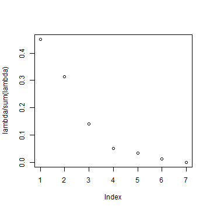
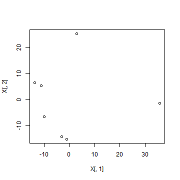
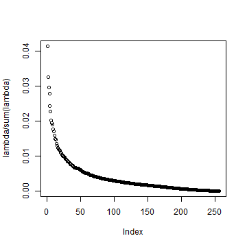
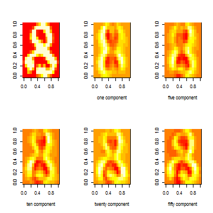
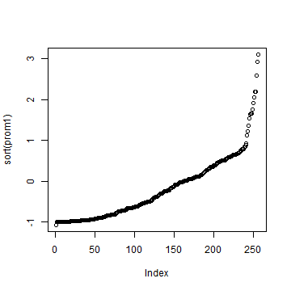
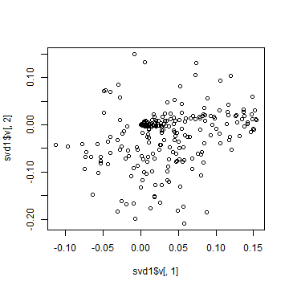

# Homework 1. MDS and PCA

#### 虞俊 1401110054

### MDS of cities
Go to the following website  

http://www.geobytes.com/citydistancetool.htm  

Perform the following experiment.

+ Input a few cities (no less than 7) in your favorite, and collect the pairwise air traveling distances shown on the website in to a matrix $D$;
+ Make your own codes of Multidimensional Scaling algorithm for $D$;
+ Plot the normalized eigenvalues $\lambda_i / (\sum_i \lambda_i)$ in a descending order of magnitudes, analyze your observations (did you see any negative eigenvalues? if yes, why?);
+ Make a scatter plot of those cities using top 2 or 3 eigenvectors, and analyze your observations.  

Solution:

```r
# Show the dataset i.e. matrix D
data <- read.csv("F:/data/distance.csv", header = T)
data <- data[, 2:8]
rownames(data) <- names(data)
data
```

```
##          Dunhuang Beijing shanghai tianjin guilin nanjing qingdao
## Dunhuang        0    1847     2602    1927   2201    2337    2283
## Beijing      1847       0     1076     108   1724     897     547
## shanghai     2602    1076        0     970   1264     267     561
## tianjin      1927     108      970       0   1672     799     438
## guilin       2201    1724     1264    1672      0    1120    1538
## nanjing      2337     897      267     799   1120       0     470
## qingdao      2283     547      561     438   1538     470       0
```

```r
# Classical MDS Algorithm
D <- as.matrix(data)
H <- diag(7) - 1/7 * rep(1, 7) %*% t(rep(1, 7))
B <- -0.5 * H %*% D %*% t(H)
lambda <- eigen(B)$value
u <- eigen(B)$vectors
# Plot the normalized eigenvalues
plot(lambda/sum(lambda))
```



```r
# scatter plot of those cities using top 2 eigenvectors
X <- u[, 1:2] %*% diag(sqrt(lambda[1:2]))
plot(X[, 1], X[, 2])
```


  
  
I didn't see any negative eigenvalues,because the place I choose are in the same country,we can regard the distance as a euclidean metric.From the second plot,we can see the distance in second plot reflect the distance in the real data matrix.  

### PCA experiments
Take any digit data (0,...,9), or all of them, from website  

http://www-stat.stanford.edu/~tibs/ElemStatLearn/datasets/zip.digits/

and perform PCA experiments with Matlab or other language you are familiar:


+ Set up data matrix $X=(x_1,\ldots,x_n)\in R^{p* n}$;
+ Compute the sample mean $\hat{\mu}_n$ and form $\tilde{X}= X - e \hat{\mu}_n^T$;
+ Compute top $k$ SVD of $\tilde{X} = U S_k V^T$;
+ Plot eigenvalue curve, i.e. $i$ vs. $\lambda_i (\hat{\Sigma}_n)/tr(\hat{\Sigma}_n)$ ($i=1,\ldots,k$), with top-$k$ eigenvalue $\lambda_i$ for sample covariance matrix $\hat{\Sigma}_n=\frac{1}{n}\tilde{X}*\tilde{X}^T$, which gives you explained variation of data by principal components;
+ Use imshow to visualize the mean and top-$k$ principle components as left singular vectors $U=[u_1,\ldots,u_k]$;
+ For $k=1$, sort the image data $(x_i)$ ($i=1,\ldots,n$) according to the top \emph{right} singular vectors, $v_1$, in an ascending order;
+ For $k=2$, scatter plot $(v_1,v_2)$ and select a grid on such a plane to show those images on the grid (e.g. Figure 14.23 in book [ESL]: Elements of Statistical Learning).
  
Solution:

```r
# Set up data matrix
X <- read.csv("F:/data/train8.csv", header = F)
X <- t(X)
# Compute the sample mean and Xhat
mu <- rowMeans(X)
mu
```

```
##        V1        V2        V3        V4        V5        V6        V7 
## -0.998502 -0.984430 -0.939161 -0.829727 -0.600395 -0.258779  0.100122 
##        V8        V9       V10       V11       V12       V13       V14 
##  0.268923  0.213755 -0.062351 -0.410474 -0.677103 -0.869557 -0.946935 
##       V15       V16       V17       V18       V19       V20       V21 
## -0.975363 -0.990557 -0.990465 -0.935806 -0.810504 -0.520406 -0.034985 
##       V22       V23       V24       V25       V26       V27       V28 
##  0.412054  0.585175  0.568524  0.507090  0.398044  0.185382 -0.231319 
##       V29       V30       V31       V32       V33       V34       V35 
## -0.632576 -0.856295 -0.938094 -0.984375 -0.978155 -0.895467 -0.689740 
##       V36       V37       V38       V39       V40       V41       V42 
## -0.209310  0.269679  0.348238  0.062044 -0.199284 -0.245066 -0.061923 
##       V43       V44       V45       V46       V47       V48       V49 
##  0.165247  0.031851 -0.436280 -0.787478 -0.923496 -0.983017 -0.970725 
##       V50       V51       V52       V53       V54       V55       V56 
## -0.881083 -0.614494 -0.080168  0.266325  0.036688 -0.403721 -0.682677 
##       V57       V58       V59       V60       V61       V62       V63 
## -0.655371 -0.330482  0.133801  0.149312 -0.320792 -0.737068 -0.922983 
##       V64       V65       V66       V67       V68       V69       V70 
## -0.990659 -0.974714 -0.885065 -0.638751 -0.170190  0.199428 -0.001164 
##       V71       V72       V73       V74       V75       V76       V77 
## -0.470812 -0.733336 -0.633035 -0.215098  0.231961  0.157419 -0.314808 
##       V78       V79       V80       V81       V82       V83       V84 
## -0.708129 -0.919358 -0.987978 -0.985902 -0.913260 -0.729101 -0.396107 
##       V85       V86       V87       V88       V89       V90       V91 
##  0.029832  0.109402 -0.222635 -0.471245 -0.304723  0.195869  0.298967 
##       V92       V93       V94       V95       V96       V97       V98 
## -0.036821 -0.449745 -0.769993 -0.933838 -0.985380 -0.988085 -0.956478 
##       V99      V100      V101      V102      V103      V104      V105 
## -0.841520 -0.610037 -0.234111  0.166590  0.172762  0.074509  0.297173 
##      V106      V107      V108      V109      V110      V111      V112 
##  0.426657  0.107637 -0.359380 -0.669893 -0.857775 -0.963745 -0.995065 
##      V113      V114      V115      V116      V117      V118      V119 
## -0.994153 -0.977542 -0.928325 -0.768015 -0.458387  0.011696  0.429681 
##      V120      V121      V122      V123      V124      V125      V126 
##  0.560299  0.599373  0.296760 -0.263489 -0.667218 -0.830649 -0.921491 
##      V127      V128      V129      V130      V131      V132      V133 
## -0.977120 -0.998295 -0.998825 -0.985554 -0.944841 -0.812666 -0.542729 
##      V134      V135      V136      V137      V138      V139      V140 
## -0.071620  0.450738  0.708410  0.573020  0.088502 -0.488066 -0.781708 
##      V141      V142      V143      V144      V145      V146      V147 
## -0.882483 -0.934825 -0.969063 -0.995614 -0.997867 -0.976022 -0.900196 
##      V148      V149      V150      V151      V152      V153      V154 
## -0.735712 -0.445793 -0.011417  0.357037  0.473524  0.339081  0.032148 
##      V155      V156      V157      V158      V159      V160      V161 
## -0.407308 -0.732701 -0.875148 -0.929991 -0.955642 -0.991271 -0.991159 
##      V162      V163      V164      V165      V166      V167      V168 
## -0.960921 -0.838432 -0.627039 -0.261349  0.101063  0.166629  0.036738 
##      V169      V170      V171      V172      V173      V174      V175 
##  0.033373  0.071537 -0.217500 -0.608734 -0.821841 -0.915577 -0.953153 
##      V176      V177      V178      V179      V180      V181      V182 
## -0.986666 -0.990242 -0.951701 -0.800738 -0.531048 -0.120806  0.141363 
##      V183      V184      V185      V186      V187      V188      V189 
## -0.058166 -0.386240 -0.282958  0.053609 -0.034245 -0.456168 -0.762260 
##      V190      V191      V192      V193      V194      V195      V196 
## -0.899306 -0.959149 -0.987732 -0.994596 -0.959779 -0.826830 -0.517469 
##      V197      V198      V199      V200      V201      V202      V203 
## -0.047469  0.177470 -0.157867 -0.611653 -0.457550  0.048227  0.131819 
##      V204      V205      V206      V207      V208      V209      V210 
## -0.308341 -0.711793 -0.902948 -0.971928 -0.993721 -0.999054 -0.981199 
##      V211      V212      V213      V214      V215      V216      V217 
## -0.892958 -0.633199 -0.093651  0.343993  0.081500 -0.354782 -0.172424 
##      V218      V219      V220      V221      V222      V223      V224 
##  0.296389  0.292341 -0.272310 -0.755192 -0.937753 -0.986037 -0.998937 
##      V225      V226      V227      V228      V229      V230      V231 
## -1.000000 -0.998421 -0.962059 -0.832681 -0.424775  0.284168  0.664541 
##      V232      V233      V234      V235      V236      V237      V238 
##  0.614723  0.683902  0.667327  0.154561 -0.511518 -0.863934 -0.972172 
##      V239      V240      V241      V242      V243      V244      V245 
## -0.997465 -1.000000 -1.000000 -1.000000 -0.997216 -0.978459 -0.877022 
##      V246      V247      V248      V249      V250      V251      V252 
## -0.530607  0.106795  0.582238  0.565945  0.078574 -0.537823 -0.856784 
##      V253      V254      V255      V256 
## -0.970821 -0.995288 -0.999996 -1.000000
```

```r
Xhat <- t(scale(t(X), center = T, scale = F))
# Compute top k SVD
s <- svd(Xhat)
# Plot eigenvalue curve and sample covariance matrix
lambda <- s$d
plot(lambda/sum(lambda))
```



```r
covmatrix <- 1/nrow(X) * Xhat %*% t(Xhat)
# 
svd1 <- svd(scale(t(X), center = T, scale = F))
# %*% is matrix multiplication Here svd1$d[1] is a constant
approx1 <- svd1$u[, 1] %*% t(svd1$v[, 1]) * svd1$d[1]
approx2 <- svd1$u[, 1:2] %*% diag(svd1$d[1:2]) %*% t(svd1$v[, 1:2])
# In these examples we need to make the diagonal matrix out of d
approx5 <- svd1$u[, 1:5] %*% diag(svd1$d[1:5]) %*% t(svd1$v[, 1:5])
approx10 <- svd1$u[, 1:10] %*% diag(svd1$d[1:10]) %*% t(svd1$v[, 1:10])
approx20 <- svd1$u[, 1:20] %*% diag(svd1$d[1:20]) %*% t(svd1$v[, 1:20])
approx50 <- svd1$u[, 1:50] %*% diag(svd1$d[1:50]) %*% t(svd1$v[, 1:50])
par(mfrow = c(2, 3))
imdata <- matrix(t(X)[1, ], 16, 16)
image(imdata)
imapprox1 <- matrix((approx1)[1, ], 16, 16)
image(imapprox1, xlab = "one component")
imapprox5 <- matrix((approx5)[1, ], 16, 16)
image(imapprox5, xlab = "five component")
imapprox10 <- matrix((approx10)[1, ], 16, 16)
image(imapprox10, xlab = "ten component")
imapprox20 <- matrix((approx20)[1, ], 16, 16)
image(imapprox20, xlab = "twenty component")
imapprox50 <- matrix((approx50)[1, ], 16, 16)
image(imapprox50, xlab = "fifty component")
```



```r
# 
par(mfrow = c(1, 1))
prom1 <- mu + lambda * svd1$v[, 1]
plot(sort(prom1))
```



```r
plot(svd1$v[, 1], svd1$v[, 2])
```



                                        
### Positive Semi-definiteness
Recall that a $n$-by-$n$ real symmetric matrix $K$ is called positive semi-definite (\emph{p.s.d.} or $K\succeq 0$) iff for every $x\in R^n$, $x^T K x\geq 0$.

+ Show that $K\succeq 0$ if and only if its eigenvalues are all nonnegative.
+ Show that $d_{ij}=K_{ii} + K_{jj} - 2 K_{ij}$ is a squared distance function, \emph{i.e.} there exists vectors $u_i,v_j \in R^n$ ($1\leq i,j \leq n$) such that $d_{ij} = \|u_i - u_j\|^2$.
+ Let $\alpha\in R^n$ be a signed measure s.t. $\sum_i \alpha_i = 1$ (or $e^T \alpha =1$) and $H_\alpha= I - e \alpha^T$ be the Householder centering matrix. Show that $B_\alpha= - \frac{1}{2} H_\alpha D H_\alpha^T\succeq 0$.
+ If $A\succeq 0$ and $B\succeq 0$ ($A,B\in R^{n\times n}$), show that $A+B = [A_{ij} + B_{ij}]_{ij} \succeq 0$ (elementwise sum), and $A\circ B= [A_{ij} B_{ij}]_{ij} \succeq 0$ (Hadamard product or elementwise product).     

Solution：
(i)Let $AX=\lambda X,X\neq 0$,here $\lambda$ is the any eigenvalue of K.Note $K\succeq 0$,$X^TKX=\lambda X^TX \ge 0$. Obviously,$X^TX\ge 0$. So $\lambda=X^TKX/(X^TX)\ge 0$.  
Assume all the eigenvalues of K is nonnegtive,we can assert that all the Leading minors are nonnegtive by using the eigenvalue decomposition.  

(ii)Let $u_i,v_j \in R^n$ be the corresponding  eigenvector,we get the result.   

(iii)Theorem 4.2 and Lemma 4.1 in the lecture note show this result directly.   


(iv)Since $A\succeq 0$ and $B\succeq 0$,for any X,we have $X^TAX\ge 0,X^TBX\ge 0$.  So $X^T(A+B)X=X^TAX+X^TBX\ge 0$  
Assume the rank of A,B are k and l,then 
$$A=\Sigma_{i=1}^kv_iv_i^T,B=\Sigma_{j=1}^lw_jw_j^T$$
then $A\circ B$ equal to $\Sigma_{i,j} u_{ij}u_{ij}^T$,here $u_{ij}=v_i \circ w_j$


